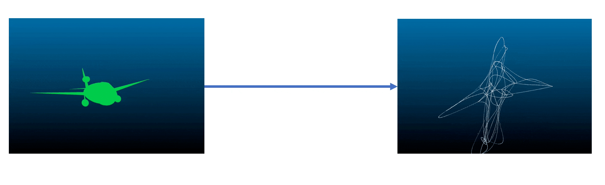

# Abstract


With Machine Learning, we have achieved promising results for 3D Model retrieval with the new input modality of 3D sketch [[1]](#1). However, to train a large-scale 3D Model retrieval system, we require a large-scale 3D sketch dataset. Ling et al [[1]](#1), used FlowRep [[3]](#3) as a graphical shape abstraction method to generate human-like 3D sketches. However, due to its strict input requirements, FlowRep could only process a limited number of 3D Models and consequently limiting the sketch dataset size.

In this thesis, we present the first learning-based method to generate human-like 3D sketches. We use 3D point clouds as the input modality to generate a set of control points of Coons Patches, where each patch is set of four Bezier Curves. These Bezier curves therefore become the skeleton of human- like sketches. Our contributions are three-fold: i) We analyse and review FlowRep necessary to understand expected arbitrary 3D sketch generation, ii) We suggest the first learning-based method inspired by a 3D representation presented by Smirnov et al to generate 3D Sketches [[2]](#2), iii) We provide possible directions for future work on this problem. While our sketches perform below par in terms of top-k accuracy for 3D model retrieval compared to FlowRep (SOTA) synthetic sketches, our method has a 100% success rate in processing input 3D models unlike FlowRep and achieves Mean Average Precision on par with FlowRep-based sketches for 3D Model Retrieval.

[Thesis](https://drive.google.com/file/d/1Zy4S1CJb2MOlifdj8MqMAf3OwSfQWaiv/view?usp=sharing)




# Pretrained Models
 - [PN-Sphere24](https://drive.google.com/file/d/1-YqPuSv3pJ6qsy5yDXT6mt1ll7lSibGE/view?usp=sharing)
 - [PN-Sphere54](https://drive.google.com/file/d/1-Yo1Kz4mpTtYQSZIVHE291rotMaTE6dS/view?usp=sharing)
 - [EC-Sphere54](https://drive.google.com/file/d/10ApGhG6TVphNXJ2bK7Dd17vf0O_vFXy9/view?usp=sharing)
 
# Generated Sketch Datasets (ModelNet10)
 - [PN-Sphere24](https://drive.google.com/drive/folders/1SdzROHFaBJwX9ntgkYcoMXV1fmbHDkf7?usp=sharing)
 - [PN-Sphere54](https://drive.google.com/drive/folders/18jMVmP2PZfSXFjb0buBsGjb7Ld0J9e8a?usp=sharing)
 - [EC-Sphere54](https://drive.google.com/drive/folders/1-nULSUpJMvEr8uFERhh03i1HXb7wpF6K?usp=sharing)


# Setup
Run the following commands in your terminal

```
git clone https://github.com/IamMohitM/PointCloudToPatches.git
cd PointCloudToPatches
pip install -e .
```

# Train
```

python src/models/train_model.py --encoder PointNet
 --batch_size 2
 --no_cuda
 --dataset_path 'dataset/modelnet40_normal_resampled'
 --checkpoint_dir 'checkpoints'
 --log_dir_suffix 'test'
 --template_dir 'dataset/templates/sphere24'

```
The above will make a checkpoint directory 'checkpoints' where checkpoints are saved and a 'checkpoints/summaries' which
 contains training and validation logs for tensorboard
 

One can explore the arguments with `python src/models/train_model.py --help`

 
# Generate Sketches

```
python src/scripts/reconstruct.py --pc_file "input.pts"
--output_file testing.pts
--file_type pts
--model_dir checkpoints
--template_dir dataset/templates/sphere24
```

reconstructs sketches from the input point cloud file

# References 
<a id="1">[1]</a> Ling et al, “Towards 3D VR-Sketch to 3D Shape Retrieval”, in International Conference on 3D Vision, 2020.

<a id="2">[2]</a> Smirnov et al, “Learning Manifold Patch-Based Representations of Man-Made Shapes”, in
International Conference on Learning Representations (ICLR), 2021 

<a id="3">[3]</a>  Gori et al, “FlowRep: Descriptive curve networks for free-form design shapes", in ACM Transactions on Graphics (TOG), 2017

## Acknowledgement

This project code is written with a combination of code from the following projects

 - [LearningPatches](https://github.com/dmsm/LearningPatches)
 - [Pointnet_Pointnet2_Pytorch](https://github.com/yanx27/Pointnet_Pointnet2_pytorch)
 - [DGCNN](https://github.com/WangYueFt/dgcnn)
 
